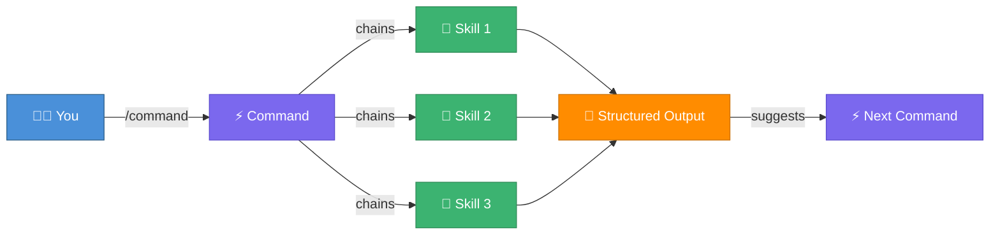
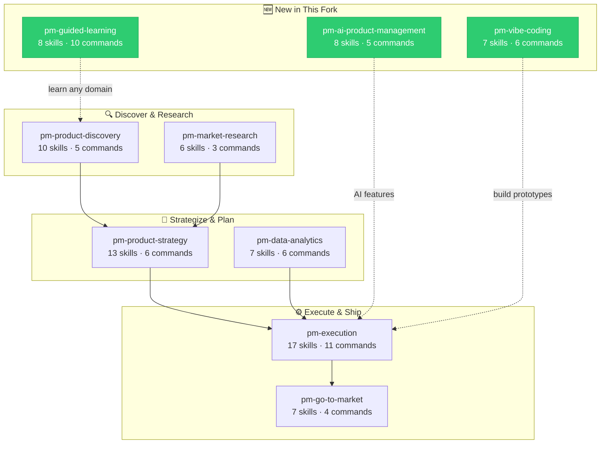

<div align="center">

# 🧠 Agentic PM Skills

### The AI Operating System for Product Managers

**9 Plugins** · **83 Skills** · **56 Commands** · **[MCP on npm](https://www.npmjs.com/package/ai-pm-skills-mcp)**

> **Stop writing prompts from scratch. Start executing proven PM frameworks with agentic AI.**

*Designed for Claude Code & Cowork · Compatible with Cursor, Gemini CLI, VS Code Copilot, Windsurf, and more*

[Getting Started](#-quick-start-what-are-you-doing-right-now) · [What's New](#-whats-new-in-this-fork) · [MCP / npm](#-installation) · [Installation](#-installation) · [All Plugins](#-available-plugins)

</div>

---

**Agentic PM Skills** is a marketplace of PM skills and chained workflows across 9 plugins. Designed natively for Claude Code and Cowork (and compatible with other AI assistants), it transforms your LLM from a generic text generator into a structured, rigorous Product Management engine.

From continuous discovery to go-to-market strategy, execution, and vibe coding—get the rigor of industry leaders (like Teresa Torres and Marty Cagan) built directly into your daily automated workflow.

> [!NOTE]
> This repository is a heavily extended and actively maintained fork of [phuryn/pm-skills](https://github.com/phuryn/pm-skills), originally created by **Paweł Huryn**. See [What's New in This Fork](#-whats-new-in-this-fork) for details.

<br />

## 🚀 The "Aha" Moment: Why Use This?

Generic AI gives you walls of text. **This repository gives you structure.**

Each skill encodes a specific, proven analytical framework. When you trigger a command, the AI doesn't just guess; it walks you through a step-by-step process for assumption mapping, prioritization, and strategy definition.

> **The result:** Better, faster product decisions — not just faster documents.

<br />

## ⚡ Quick Start: What Are You Doing Right Now?

| I am… | Start with | Then try |
|:-------|:-----------|:---------|
| 💡 **Exploring a new idea** | `/discover` | → `/strategy` → `/plan-launch` |
| 📦 **Shipping a feature** | `/write-prd` | → `/write-stories` → `/sprint` |
| 🤝 **Preparing for a meeting** | `/prep-meeting` | → `/write-update` → `/challenge` |
| 🚀 **Launching a product** | `/plan-launch` | → `/battlecard` → `/marketing-plan` |
| 🛠️ **Building a prototype** | `/plan-prototype` | → `/vibe-spec` → `/deploy-check` |
| 🤖 **Building an AI feature** | `/ai-spec` | → `/ai-model-eval` → `/responsible-ai-review` |
| 📊 **Defining metrics** | `/north-star` | → `/design-funnel` → `/plan-tracking` |
| 🎓 **New to PM / learning** | `/learn` | → Pick any `/learn-*` module |
| 🧭 **Not sure where to start?** | `/find-skill` | Describes your task, gets routed |

<br />

## 🆕 What's New in This Fork

This project is a **heavily extended fork** of [phuryn/pm-skills](https://github.com/phuryn/pm-skills), originally created by **Paweł Huryn**. The table below highlights what this fork adds beyond the upstream version:

<table>
<tr>
<th width="200">Area</th>
<th width="300">Upstream (<a href="https://github.com/phuryn/pm-skills">phuryn/pm-skills</a>)</th>
<th width="300">This Fork (<a href="https://github.com/tarunccet/pm-skills">tarunccet/pm-skills</a>)</th>
</tr>
<tr>
<td><strong>📦 Plugins</strong></td>
<td>8 plugins</td>
<td><strong>9 plugins</strong> — 3 brand-new domains added</td>
</tr>
<tr>
<td><strong>🧠 Skills</strong></td>
<td>65 skills</td>
<td><strong>83 skills</strong> (+28% coverage)</td>
</tr>
<tr>
<td><strong>⚡ Commands</strong></td>
<td>36 commands</td>
<td><strong>56 commands</strong> (+56% more workflows)</td>
</tr>
<tr>
<td><strong>🤖 AI Product Mgmt</strong></td>
<td>—</td>
<td>✅ <strong>New plugin:</strong> <code>pm-ai-product-management</code> — AI specs, model eval, responsible AI, prompt engineering (8 skills, 5 commands)</td>
</tr>
<tr>
<td><strong>🛠️ Vibe Coding</strong></td>
<td>—</td>
<td>✅ <strong>New plugin:</strong> <code>pm-vibe-coding</code> — Prototype planning, vibe specs, code review for PMs, deploy checklists (7 skills, 6 commands)</td>
</tr>
<tr>
<td><strong>🎓 Guided Learning</strong></td>
<td>—</td>
<td>✅ <strong>New plugin:</strong> <code>pm-guided-learning</code> — Socratic-method learning modules for discovery, strategy, metrics, AI PM, and more (8 skills, 10 commands)</td>
</tr>
<tr>
<td><strong>😈 Devil's Advocate</strong></td>
<td>—</td>
<td>✅ <strong>New skill</strong> in pm-product-strategy — Stress-test ideas, proposals, and strategies</td>
</tr>
<tr>
<td><strong>🔧 Tool Compatibility</strong></td>
<td>Claude, Gemini CLI, OpenCode, Cursor, Codex CLI, Kiro</td>
<td>All upstream + <strong>VS Code Copilot Chat</strong> and <strong>Windsurf</strong></td>
</tr>
<tr>
<td><strong>📋 Skill Quality</strong></td>
<td>Basic frontmatter</td>
<td>Enhanced quality standards with required sections: Purpose, Domain Context, When to Use / Not Use, Examples</td>
</tr>
</table>

> [!TIP]
> The original upstream skills remain fully intact. This fork **extends** — it doesn't replace. All attribution to framework authors (Teresa Torres, Marty Cagan, Alberto Savoia, etc.) is preserved.

<br />

---

## 🏗️ How It Works (Skills, Commands, Plugins)



| Concept | What it is | Example |
|:--------|:-----------|:--------|
| **🧠 Skill** | Domain knowledge, analytical framework, or guided workflow for a specific PM task. Loaded automatically when relevant. | `opportunity-solution-tree`, `prioritization` |
| **⚡ Command** | User-triggered workflow (`/command-name`) that chains one or more skills into an end-to-end process. | `/discover` chains: ideation → assumptions → prioritization → experiments |
| **📦 Plugin** | Installable package grouping related skills and commands by PM domain. | `pm-product-discovery`, `pm-execution` |

Skills are loaded automatically when relevant to the conversation — no explicit invocation needed. If needed (e.g., prioritizing skills over general knowledge), you can **force loading skills** with `/plugin-name:skill-name` or `/skill-name`.

Installing the marketplace gives you all 9 plugins at once. Commands are designed to flow into each other, matching the PM workflow — after any command completes, it suggests relevant next commands.

<br />

## 🛠️ How Vibe Coding Skills Work

Vibe coding is the practice of building software through natural language instructions to AI coding assistants, with the human providing product direction, design judgment, and validation rather than writing code line-by-line. The `pm-vibe-coding` plugin is designed specifically to help PMs do this effectively.

### Starting Out
Use `/plan-prototype` or ask _"Help me plan a prototype build"_. The skill helps you scope the MVP to the minimum features needed, identify the single most important user story, and define what "done" looks like — before writing a single line of code.

### Choosing and Installing the Right Tools
The `prototype-plan` skill includes a built-in tool selection guide based on your project's needs:

| What you're building | Recommended tool |
|----------------------|-----------------|
| Frontend UI only (no backend needed) | Bolt.new or v0.dev |
| Quick full-stack demo, zero setup | Replit Agent |
| Complex full-stack app with fine-grained control | Cursor |
| Existing VS Code project or iterative work | GitHub Copilot |
| Complex logic, debugging, architecture | Claude Code |
| Multi-file agentic flows | Windsurf |

Once you pick a tool, `/vibe-spec` generates the natural-language spec document that you paste directly into your chosen AI coding assistant — giving it all the context it needs to build correctly the first time.

### Starting to Code
The build sequence recommended by `prototype-plan` guides you through:
1. **Foundation**: Set up the project, define data model, connect database
2. **Backend/API**: Build core endpoints, add validation, test with a client
3. **Frontend**: Build the primary user flow, connect to backend
4. **Auth**: Add sign-up/login, protect routes
5. **Deploy**: Deploy to hosting, set environment variables, run final checklist

At each stage, checkpoints verify you're ready to move on. The `code-review-for-pms` skill helps you review AI-generated code from a product and security lens, and `debug-with-ai` guides you when things break. Before shipping, `/deploy-check` runs through a pre-launch checklist covering security, performance, and accessibility.

<br />

## 📥 Installation

### ⚡ MCP Server — works everywhere, zero clone needed

`ai-pm-skills-mcp` is an [MCP](https://modelcontextprotocol.io) server that exposes all 83 skills and 56 commands as tools to **any MCP-compatible client** — Claude Desktop, Claude Code, Cursor, Windsurf, and more — without cloning this repo.

**One-time setup per client:**

<details>
<summary><strong>Claude Desktop</strong> (<code>~/Library/Application Support/Claude/claude_desktop_config.json</code>)</summary>

```json
{
  "mcpServers": {
    "pm-skills": {
      "command": "npx",
      "args": ["-y", "ai-pm-skills-mcp"]
    }
  }
}
```
</details>

<details>
<summary><strong>Claude Code</strong> (run once in your terminal)</summary>

```bash
claude mcp add pm-skills -- npx -y ai-pm-skills-mcp
```
</details>

<details>
<summary><strong>Cursor</strong> (<code>~/.cursor/mcp.json</code>)</summary>

```json
{
  "mcpServers": {
    "pm-skills": {
      "command": "npx",
      "args": ["-y", "ai-pm-skills-mcp"]
    }
  }
}
```
</details>

<details>
<summary><strong>Windsurf</strong> (Settings → MCP Servers → Add)</summary>

```json
{
  "mcpServers": {
    "pm-skills": {
      "command": "npx",
      "args": ["-y", "ai-pm-skills-mcp"]
    }
  }
}
```
</details>

Once configured, ask your AI assistant:
- *"List all PM skills"* → calls `list_plugins` / `list_skills`
- *"Get the lean-canvas skill"* → calls `get_skill`
- *"Search for OKR skills"* → calls `search_skills`

> **No git clone, no copy-paste, no manual updates.** `npx` always pulls the latest published version.

---

### Claude Cowork (recommended for non-developers)

1. Open **Customize** (bottom-left)
2. Go to **Browse plugins** → **Personal** → **+**
3. Select **Add marketplace from GitHub**
4. Enter: `tarunccet/pm-skills`

All 9 plugins install automatically. You get both commands (`/discover`, `/strategy`, etc.) and skills.

### Claude Code (CLI)

```bash
# Step 1: Add the marketplace
claude plugin marketplace add tarunccet/pm-skills

# Step 2: Install individual plugins
claude plugin install pm-product-strategy@pm-skills
claude plugin install pm-product-discovery@pm-skills 
claude plugin install pm-market-research@pm-skills 
claude plugin install pm-data-analytics@pm-skills
claude plugin install pm-go-to-market@pm-skills
claude plugin install pm-execution@pm-skills
claude plugin install pm-ai-product-management@pm-skills
claude plugin install pm-vibe-coding@pm-skills
claude plugin install pm-guided-learning@pm-skills
```

### Other AI assistants (skills only)

The `skills/*/SKILL.md` files follow the universal skill format and work with any tool that reads markdown. Full plugin + command support (via `.claude-plugin/`) is currently available on Claude Code and Claude Cowork only.

| Tool | How to use | What works |
|------|-----------|------------|
| **VS Code Copilot Chat** | Copy skill folders to `.github/skills/` or paste SKILL.md content into `.github/copilot-instructions.md` | Skills only |
| **Gemini CLI** | Copy skill folders to `.gemini/skills/` | Skills only |
| **OpenCode** | Copy skill folders to `.opencode/skills/` | Skills only |
| **Cursor** | Copy skill folders to `.cursor/skills/` | Skills only |
| **Windsurf** | Copy skill folders to `.windsurf/skills/` | Skills only |
| **Codex CLI** | Copy skill folders to `.codex/skills/` | Skills only |
| **Kiro** | Copy skill folders to `.kiro/skills/` | Skills only |

```bash
# Example: copy all skills for OpenCode (project-level)
for plugin in pm-*/; do
  mkdir -p .opencode/skills/
  cp -r "$plugin/skills/"* .opencode/skills/ 2>/dev/null
done

# Example: copy all skills for Gemini CLI (global)
for plugin in pm-*/; do
  cp -r "$plugin/skills/"* ~/.gemini/skills/ 2>/dev/null
done
```

---

## 📚 Available Plugins

> **9 plugins** · **83 skills** · **56 commands** — covering the full PM lifecycle



<details>
<summary><strong>1. pm-product-discovery</strong> — Ideation, experiments, assumption testing, OSTs, interviews (10 skills, 5 commands)</summary>

**Skills (10):**

- `brainstorm-ideas-existing` — Multi-perspective ideation for existing products (PM, Designer, Engineer)
- `brainstorm-ideas-new` — Ideation for new products in initial discovery
- `brainstorm-experiments-existing` — Design experiments to test assumptions for existing products
- `brainstorm-experiments-new` — Design lean startup pretotypes for new products (Alberto Savoia)
- `identify-assumptions-existing` — Identify risky assumptions across Value, Usability, Viability, and Feasibility
- `identify-assumptions-new` — Identify risky assumptions across 8 risk categories including Go-to-Market, Strategy, and Team
- `analyze-feature-requests` — Analyze and prioritize feature requests by theme, strategic alignment, impact, effort, and risk
- `opportunity-solution-tree` — Build an Opportunity Solution Tree (Teresa Torres) — outcome → opportunities → solutions → experiments
- `interview-script` — Create a structured customer interview script with JTBD probing questions
- `summarize-interview` — Summarize an interview transcript into JTBD, satisfaction signals, and action items

**Commands (5):**

- `/discover` — Full discovery cycle: ideation → assumption mapping → prioritization → experiment design
- `/brainstorm` — Multi-perspective ideation (`ideas|experiments` × `existing|new`)
- `/triage-requests` — Analyze and prioritize a batch of feature requests
- `/interview` — Prepare an interview script or summarize a transcript (`prep|summarize`)
- `/setup-metrics` — Design a product metrics dashboard

**Examples:**

Skills:
- `What are the riskiest assumptions for our AI writing assistant idea?`
- `Help me build an Opportunity Solution Tree for improving user activation`
- `Prioritize these 12 feature requests from our enterprise customers [attach CSV]`

Commands:
- `/discover AI-powered meeting summarizer for remote teams`
- `/brainstorm experiments existing — We need to reduce churn in our onboarding flow`
- `/interview prep — We're interviewing enterprise buyers about their procurement workflow`

</details>

<details>
<summary><strong>2. pm-product-strategy</strong> — Vision, business models, pricing, competitive landscape, devil's advocate (13 skills, 6 commands)</summary>

Product strategy, vision, business models, pricing, macro environment analysis, and stress-testing. Covers the full strategic toolkit from vision crafting through competitive landscape scanning to stress-testing ideas.

**Skills (13):**

- `product-strategy` — Comprehensive 9-section Product Strategy Canvas (vision → defensibility)
- `startup-canvas` — Startup Canvas combining Product Strategy (9 sections) + Business Model — an alternative to BMC and Lean Canvas for new products
- `product-vision` — Craft an inspiring, achievable, and emotional product vision
- `value-proposition-canvas` — 6-part JTBD value proposition (Who, Why, What before, How, What after, Alternatives)
- `lean-canvas` — Lean Canvas business model for startups and new products
- `business-model` — Business Model Canvas with all 9 building blocks
- `monetization-models` — Brainstorm 3–5 monetization strategies with validation experiments
- `pricing-strategy` — Pricing models, competitive analysis, willingness-to-pay, and price elasticity
- `swot-analysis` — SWOT analysis with actionable recommendations
- `pestle-analysis` — Macro environment: Political, Economic, Social, Technological, Legal, Environmental
- `porters-five-forces` — Competitive forces analysis (rivalry, suppliers, buyers, substitutes, new entrants)
- `ansoff-matrix` — Growth strategy mapping across markets and products
- `devil-advocate` — Constructive critic and stress-tester for PM ideas, proposals, and strategies

**Commands (6):**

- `/strategy` — Create a complete 9-section Product Strategy Canvas
- `/business-model` — Explore business models (`lean|full|startup|value-prop|all`)
- `/value-proposition` — Design a value proposition using the 6-part JTBD template
- `/market-scan` — Macro environment analysis combining SWOT + PESTLE + Porter's + Ansoff
- `/pricing` — Design a pricing strategy with competitive analysis and experiments
- `/challenge` — Stress-test an idea, proposal, or strategy — find weaknesses and strengthen your thinking

**Examples:**

Skills:
- `Compare Lean Canvas vs Business Model Canvas vs Startup Canvas for my marketplace startup`
- `Design a value proposition for our AI writing assistant targeting non-native English speakers`
- `Run a Porter's Five Forces analysis for the project management SaaS market`
- `Challenge my proposal to pause iOS development this quarter`

Commands:
- `/strategy B2B project management tool for agencies`
- `/business-model startup — AI writing tool for non-native English speakers`
- `/value-proposition SaaS onboarding tool for enterprise customers`
- `/challenge [paste your PRD or proposal] Find the weaknesses`

</details>

<details>
<summary><strong>3. pm-execution</strong> — PRDs, OKRs, roadmaps, sprints, retros, release notes, stakeholder management, writing, meeting prep (17 skills, 11 commands)</summary>

Day-to-day product management: PRDs, OKRs, roadmaps, sprints, retrospectives, release notes, pre-mortems, stakeholder management, user stories, prioritization frameworks, general-purpose writing, meeting preparation, and stakeholder updates.

#### Plan & Build

**Skills:**

- `create-prd` — Comprehensive 8-section PRD template
- `brainstorm-okrs` — Team-level OKRs aligned with company objectives
- `outcome-roadmap` — Transform a feature list into an outcome-focused roadmap
- `sprint-plan` — Sprint planning with capacity estimation, story selection, and risk identification
- `retro` — Structured sprint retrospective facilitation
- `release-notes` — User-facing release notes from tickets, PRDs, or changelogs
- `user-stories` — User stories following the 3 C's and INVEST criteria
- `job-stories` — Job stories: When [situation], I want to [motivation], so I can [outcome]
- `wwas` — Product backlog items in Why-What-Acceptance format
- `test-scenarios` — Test scenarios: happy paths, edge cases, error handling
- `prioritization` — Reference guide to 9 prioritization frameworks (Opportunity Score, ICE, RICE, MoSCoW, Kano, etc.)

**Commands:**

- `/write-prd` — Create a PRD from a feature idea or problem statement
- `/plan-okrs` — Brainstorm team-level OKRs
- `/transform-roadmap` — Convert a feature-based roadmap into outcome-focused
- `/sprint` — Sprint lifecycle (`plan|retro|release`)
- `/write-stories` — Break features into backlog items (`user|job|wwa`)
- `/test-scenarios` — Generate test scenarios from user stories

#### Communicate & Align

**Skills:**

- `pre-mortem` — Risk analysis with Tigers/Paper Tigers/Elephants classification
- `stakeholder-map` — Power × Interest grid with tailored communication plan
- `stakeholder-update` — Structured stakeholder updates, status reports, and executive summaries with audience-calibrated detail levels
- `summarize-meeting` — Meeting transcript → decisions + action items
- `meeting-prep` — Prepare for any PM meeting — 1:1s, stakeholder alignments, leadership reviews, and cross-functional planning sessions
- `writer` — General-purpose PM writing assistant for briefs, emails, Slack messages, proposals, and presentations

**Commands:**

- `/pre-mortem` — Pre-mortem risk analysis on a PRD or launch plan
- `/meeting-notes` — Summarize a meeting transcript into structured notes
- `/stakeholder-map` — Map stakeholders and create a communication plan
- `/prep-meeting` — Prepare for any PM meeting with structured talking points, anticipated questions, and success criteria
- `/write-update` — Create a polished stakeholder update or status report tailored to your audience

**Examples:**

Skills:
- `Which prioritization framework should I use for a 50-item backlog?`
- `Map our stakeholders for the platform migration project`
- `What's the difference between Opportunity Score, ICE, and RICE?`
- `Help me write an email to my VP about why we need to delay the feature launch by 2 weeks`
- `I have a 1:1 with my manager tomorrow — help me prepare talking points`
- `Write a weekly status update for the push notifications project`

Commands:
- `/write-prd Smart notification system that reduces alert fatigue`
- `/sprint retro — Here are the notes from our last sprint`
- `/write-stories job — Break down the "team dashboard" feature into job stories`
- `/prep-meeting 1:1 with my manager about project deprioritization`
- `/write-update Weekly progress on the Search Redesign project for leadership`

</details>

<details>
<summary><strong>4. pm-market-research</strong> — Personas, segmentation, journey maps, market sizing, competitor analysis (6 skills, 3 commands)</summary>

User research and competitive analysis: personas, segmentation, journey maps, market sizing, competitor analysis, and feedback analysis.

**Skills (6):**

- `research-personas` — Create refined user personas from research data
- `user-segmentation` — Unified segmentation: market segments, user/feedback segmentation, or beachhead selection
- `customer-journey-map` — End-to-end journey map with stages, touchpoints, emotions, and pain points
- `market-sizing` — TAM, SAM, SOM with top-down and bottom-up approaches
- `competitor-analysis` — Competitor strengths, weaknesses, and differentiation opportunities
- `sentiment-analysis` — Sentiment analysis and theme extraction from user feedback

**Commands (3):**

- `/research-users` — Build personas, segment users, and map the customer journey
- `/competitive-analysis` — Analyze the competitive landscape
- `/analyze-feedback` — Sentiment analysis and segment insights from user feedback

**Examples:**

Skills:
- `Estimate TAM/SAM/SOM for an AI code review tool in the US market`
- `Create a customer journey map for our e-commerce checkout flow`
- `Segment these survey respondents by behavior and needs [attach CSV]`

Commands:
- `/research-users We have interview data from 12 users of our fitness app`
- `/competitive-analysis Figma competitors in the design tool space`
- `/analyze-feedback Here's 200 NPS responses from Q4 [attach file]`

</details>

<details>
<summary><strong>5. pm-data-analytics</strong> — SQL generation, cohort analysis, A/B test analysis, funnel analysis, event tracking, metric definition, North Star (7 skills, 6 commands)</summary>

Data analytics for PMs: SQL query generation, cohort analysis, A/B test analysis, funnel analysis, event tracking planning, metric definition, and North Star metric definition.

**Skills (7):**

- `sql-queries` — Generate SQL from natural language (BigQuery, PostgreSQL, MySQL)
- `cohort-analysis` — Retention curves, feature adoption, and engagement trends by cohort
- `ab-test-analysis` — Statistical significance, sample size validation, and ship/extend/stop recommendations
- `product-metrics` — Complete product metrics framework: North Star, input metrics, health metrics, dashboard design, and AI metrics layer
- `funnel-analysis` — Analyze conversion funnels: drop-off points, conversion rates, leakage hypotheses, and improvement experiments
- `event-tracking-plan` — Design an analytics instrumentation plan: events, properties, naming conventions, and tracking spec
- `metric-definition` — Define and distinguish operational vs vanity vs actionable metrics with full metric specs

**Commands (6):**

- `/write-query` — Generate SQL queries from natural language
- `/analyze-cohorts` — Cohort analysis on user engagement data
- `/analyze-test` — Analyze A/B test results
- `/north-star` — Define your North Star Metric and supporting input metrics
- `/design-funnel` — Analyze a conversion funnel and get improvement recommendations
- `/plan-tracking` — Design an analytics event tracking plan

**Examples:**

Skills:
- `How large a sample do I need for 95% confidence with a 2% MDE?`
- `What retention metrics should I track for a subscription app?`
- `Design an event tracking plan for our onboarding flow`

Commands:
- `/write-query Show me monthly active users by country for Q4 2025 (BigQuery)`
- `/north-star Two-sided marketplace connecting freelancers with clients`
- `/design-funnel Our signup → activation → first purchase funnel for an e-commerce app`

</details>

<details>
<summary><strong>6. pm-go-to-market</strong> — Beachhead segments, ICPs, messaging, growth loops, GTM motions, battlecards, marketing ideas, positioning, product naming (7 skills, 4 commands)</summary>

Go-to-market strategy: beachhead segments, ideal customer profiles, messaging, growth loops, GTM motions, competitive battlecards, marketing ideas, positioning, and product naming.

**Skills (9):**

- `gtm-strategy` — Full GTM strategy: channels, messaging, success metrics, and launch plan
- `beachhead-segment` — Identify the first beachhead market segment
- `ideal-customer-profile` — ICP with demographics, behaviors, JTBD, and needs
- `growth-loops` — Design sustainable growth loops (flywheels)
- `gtm-motions` — Evaluate GTM motions and tools (product-led, sales-led, etc.)
- `competitive-battlecard` — Sales-ready battlecard with objection handling and win strategies
- `marketing-ideas` — Creative, cost-effective marketing ideas with channels and messaging
- `positioning-ideas` — Product positioning differentiated from competitors
- `product-name` — Product name brainstorming aligned to brand values and audience

**Commands (4):**

- `/plan-launch` — Full GTM strategy from beachhead to launch plan
- `/growth-strategy` — Design growth loops and evaluate GTM motions
- `/battlecard` — Create a competitive battlecard
- `/marketing-plan` — Brainstorm marketing ideas, positioning, value props, and product names

**Examples:**

Skills:
- `What's the best beachhead segment for a developer productivity tool?`
- `Design a growth loop for a B2B SaaS with a freemium tier`
- `Brainstorm 5 positioning angles that differentiate us from Notion`

Commands:
- `/plan-launch AI code review tool targeting mid-size engineering teams`
- `/battlecard Our CRM vs Salesforce for the SMB market`
- `/marketing-plan B2B analytics dashboard for e-commerce managers`

</details>

<details>
<summary><strong>7. pm-ai-product-management</strong> 🆕 — AI feature specs, model evaluation, responsible AI, prompt engineering, AI incidents (8 skills, 5 commands)</summary>

Skills for the full AI product lifecycle — from evaluating models and writing AI feature specs to running responsible AI reviews, handling AI incidents, and building data strategies.

**Skills (8):**

- `ai-feature-definition` — Write a complete AI feature spec: model behaviour, input/output examples, confidence thresholds, fallback logic
- `ai-model-evaluation` — Evaluate and compare LLMs, ML APIs, and fine-tuned models for product fit across quality, latency, cost, and compliance
- `ai-build-buy-partner` — Evaluate AI capability sourcing: build, buy, fine-tune, or partner using a structured decision matrix
- `ai-data-strategy` — Data strategy for AI products: training data, data quality, labeling, feedback loops, and retraining
- `ai-user-research` — Research user expectations, trust calibration, and interaction patterns for AI-powered features
- `ai-incident-response` — Handle AI model failures, quality regressions, bias incidents, and safety issues
- `prompt-engineering` — Craft and manage production-quality prompts: system prompts, few-shot examples, chain-of-thought, and guardrails
- `responsible-ai` — Assess AI features for ethical risks, bias, safety, fairness gaps, and regulatory compliance

**Commands (5):**

- `/ai-spec` — Create an AI feature specification with behaviour requirements and fallback design
- `/ai-model-eval` — Evaluate and compare AI models or vendors for a specific use case
- `/responsible-ai-review` — Review an AI feature for ethical risks, bias, safety, and regulatory compliance
- `/ai-metrics` — Define success metrics for an AI feature — model quality, operational, product, and business KPIs
- `/ai-roadmap` — Create an AI product roadmap accounting for model uncertainty, data requirements, and iterative improvement

**Examples:**

Skills:
- `Evaluate GPT-4 vs Claude vs Gemini for our customer support chatbot use case`
- `Write an AI feature spec for smart email categorization with confidence thresholds`
- `Assess our recommendation engine for bias and fairness issues`

Commands:
- `/ai-spec Smart document summarization for legal contracts`
- `/ai-model-eval Which LLM should we use for code review suggestions?`
- `/responsible-ai-review Our AI hiring screening tool — check for bias and compliance`

</details>

<details>
<summary><strong>8. pm-vibe-coding</strong> 🆕 — Vibe specs, prototyping plans, tech decisions, code review, deployment, debugging, technical analysis (7 skills, 6 commands)</summary>

Skills for PMs building products with AI-assisted coding tools (Cursor, Replit, GitHub Copilot, Claude Code) and understanding technical systems.

**Skills (7):**

- `vibe-coding-spec` — Write a natural-language specification optimized for AI coding assistants
- `prototype-plan` — Plan an AI-assisted prototyping session with tool selection and build sequence
- `technical-analyst` — Technical translator for PMs — helps understand systems, codebases, APIs, and technical concepts in PM-friendly terms
- `technical-decision-guide` — Make technical architecture decisions without deep engineering background
- `code-review-for-pms` — Review AI-generated code from a PM perspective
- `deploy-checklist` — Pre-launch deployment checklist for PM-builders
- `debug-with-ai` — Guide through debugging AI-generated code

**Commands (6):**

- `/vibe-spec` — Create a vibe coding specification
- `/plan-prototype` — Plan an AI-assisted build session
- `/tech-decision` — Get guidance on a technical architecture decision
- `/review-code` — Review AI-generated code from a PM perspective
- `/deploy-check` — Run through a deployment checklist
- `/debug-help` — Get help debugging AI-generated code

**Examples:**

Skills:
- `Explain how the in-app messaging service works from a PM perspective`
- `Our Android opt-in flows have lower conversion than iOS — can you figure out why from the code?`

Commands:
- `/vibe-spec A job board for climate tech roles`
- `/plan-prototype A waitlist page with referral tracking`
- `/tech-decision Which database should I use for my app?`
- `/deploy-check My Next.js app before sharing with beta users`

</details>

<details>
<summary><strong>9. pm-guided-learning</strong> 🆕 — Interactive Socratic learning modules for PM skills (8 skills, 10 commands)</summary>

**For PM aspirants, career-switchers, and PMs leveling up into new domains.**

- 🟢 **New PMs** (0-2 years) — Start with `/learn-discovery` and `/learn-metrics`
- 🟡 **Experienced PMs entering AI** — Start with `/learn-ai-pm` and `/learn-vibe-coding`
- 🔵 **Experienced PMs refreshing fundamentals** — Use any module as a 15-minute refresher

> Already a working PM? Skip to the doing plugins (`/discover`, `/write-prd`, `/plan-launch`). Come back here when you want to sharpen a specific skill.

Interactive, Socratic-method learning modules. These skills teach PM concepts through guided exercises and simulations — they don't produce deliverables, they build skills.

**Skills (8):**

- `learn-discovery` — Guided learning on continuous discovery (Teresa Torres's OST framework) via simulated scenario
- `learn-strategy` — Guided learning on product strategy using Roger Martin's Playing to Win cascade
- `learn-metrics` — Interactive metrics workshop: define NSM, input metrics, and counter-metrics for a fictional product
- `learn-prioritization` — Apply RICE, ICE, and Opportunity Score to the same backlog and compare results
- `learn-user-research` — Simulated user interview practice with feedback on question quality and bias
- `learn-stakeholder-management` — Simulated stakeholder alignment scenario with conflicting priorities
- `learn-ai-pm` — Guided learning on AI product management: model evaluation, responsible AI, prompt engineering, and AI metrics
- `learn-vibe-coding` — Interactive guide to getting started with vibe coding: tool selection, writing specs, building prototypes, and shipping

**Commands (10):**

- `/learn` — Discover all learning modules and get a recommendation based on your experience level
- `/learn-discovery` — Start the discovery learning module
- `/learn-strategy` — Start the strategy learning module
- `/learn-metrics` — Start the metrics learning module
- `/learn-prioritization` — Start the prioritization learning module
- `/learn-interview` — Start the user research interview practice
- `/learn-stakeholders` — Start the stakeholder management simulation
- `/learn-ai-pm` — Start the AI product management learning module
- `/learn-vibe-coding` — Start the vibe coding learning module
- `/find-skill` — Discover the right PM skill for your current situation

**Examples:**

Commands:
- `/learn` — I'm a new PM, what should I learn first?
- `/learn-discovery` — Start the OST discovery module
- `/learn-interview` — Practice user interview techniques
- `/learn-ai-pm` — Learn how to evaluate and manage AI features
- `/learn-vibe-coding` — Get started building with AI coding tools

</details>

---

## 📖 About & Attribution

<div align="center">

*This marketplace evolves with product practice and AI capabilities.*

</div>

Originally curated by **Paweł Huryn** ([phuryn/pm-skills](https://github.com/phuryn/pm-skills)). Extended and maintained by **[Tarun Narang](mailto:tarunccet@gmail.com)**.

<details>
<summary><strong>📚 Framework Authors & References</strong></summary>
<br />

Selected skills are based on the work of:

| Author | Work |
|:-------|:-----|
| Teresa Torres | [*Continuous Discovery Habits*](https://www.amazon.com/Continuous-Discovery-Habits-Discover-Products/dp/1736633309/) |
| Marty Cagan | [*INSPIRED*](https://www.amazon.com/INSPIRED-Create-Tech-Products-Customers/dp/1119387507/) · [*TRANSFORMED*](https://www.amazon.com/dp/1119697336/) |
| Alberto Savoia | [*The Right It*](https://www.amazon.com/Right-Many-Ideas-Yours-Succeed/dp/0062884654) |
| Dan Olsen | [*The Lean Product Playbook*](https://www.amazon.com/dp/1118960874/) |
| Roger L. Martin | [*Playing to Win*](https://www.amazon.com/Playing-Win-Expanded-Bonus-Articles/dp/B0F25SDYWV/) |
| Ash Maurya | [*Running Lean*](https://www.amazon.com/dp/B004J4XGN6/) |
| Strategyzer | [*Business Model Generation*](https://www.amazon.com/dp/0470876417/) · [*Value Proposition Design*](https://www.amazon.com/dp/1118968050/) |
| Christina Wodtke | [*Radical Focus*](https://www.amazon.com/Radical-Focus-Achieving-Important-Objectives/dp/0996006052) |
| Anthony W. Ulwick | [*Jobs to Be Done*](https://jobs-to-be-done-book.com/) |
| Alistair Croll & Benjamin Yoskovitz | [*Lean Analytics*](https://www.amazon.com/Lean-Analytics-Better-Startup-Faster/dp/1449335675/) |
| Sean Ellis | [*Hacking Growth*](https://www.amazon.com/Hacking-Growth-Fastest-Growing-Companies-Breakout/dp/045149721X/) |
| Maja Voje | [*Go-To-Market Strategist*](https://gtmstrategist.com/) |

</details>

## 🤝 Contributing

Contributions welcome! See [CONTRIBUTING.md](CONTRIBUTING.md) for guidelines.

## ⚠️ Known Issue on Windows

If your Cowork is unstable and can't start a VM ([claude-code/issues/27010](https://github.com/anthropics/claude-code/issues/27010)), try:

```powershell
$action = New-ScheduledTaskAction -Execute "powershell.exe" -Argument "-WindowStyle Hidden -Command `"if ((Get-Service CoworkVMService).Status -ne 'Running') { Start-Service CoworkVMService }`""

$trigger = New-ScheduledTaskTrigger -RepetitionInterval (New-TimeSpan -Minutes 1) -Once -At (Get-Date)

$settings = New-ScheduledTaskSettingsSet -AllowStartIfOnBatteries -DontStopIfGoingOnBatteries

Register-ScheduledTask -TaskName "CoworkVMServiceMonitor" `
  -Action $action `
  -Trigger $trigger `
  -Settings $settings `
  -RunLevel Highest `
  -User "SYSTEM"
```

It solves 90% of the issues on Windows.
The remaining 10%: open services.msc > start "Claude" service manually

## 📄 License

MIT — see [LICENSE](LICENSE).

---

<div align="center">

**Made with ❤️ for the PM community**

[⬆ Back to top](#-agentic-pm-skills)

</div>
