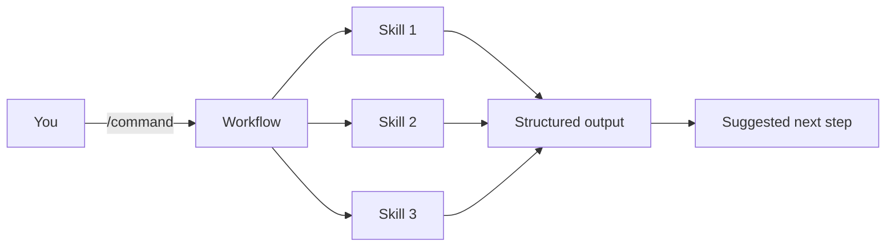

<div align="center">

# 🧠 Agentic PM Skills

### The PM operating system for AI-native product teams

**9 Plugins** · **93 Skills** · **63 Commands** · [MCP on npm](https://www.npmjs.com/package/ai-pm-skills-mcp)

> **Turn vague prompting into structured PM workflows for discovery, strategy, execution, AI product work, GTM, analytics, and PM learning.**

*Designed for Claude Code & Cowork · Works with MCP clients like Claude Desktop, Cursor, and Windsurf · Skills also work in Copilot, Gemini CLI, OpenCode, Codex CLI, and more*

[Getting Started](docs/getting-started.md) · [Starter Packs](docs/starter-packs.md) · [Proof & Examples](docs/case-studies.md) · [Compatibility Matrix](docs/compatibility-matrix.md) · [FAQ](docs/faq.md)

</div>

---

**Agentic PM Skills** packages proven PM frameworks into reusable skills and workflows so your AI helps you think more clearly, not just write faster.

Instead of prompting from scratch every time, you get structured commands for discovery, PRDs, prioritization, go-to-market, AI features, prototyping, and guided PM learning.

## ⚡ 30-Second Quickstart

### 1) Install once

**MCP (recommended):** add the server to your AI client.

```bash
claude mcp add pm-skills -- npx -y ai-pm-skills-mcp
```

For Claude Desktop, Cursor, and Windsurf setup snippets, see [docs/getting-started.md](docs/getting-started.md).

### 2) Start with a real PM task

```text
/discover Improve activation for first-time users
/write-prd Smart notification batching for enterprise teams
/ai-feature-launch AI copilot for support ticket triage
/plan-prototype Internal tool for customer interview synthesis
```

### 3) Keep moving through the workflow

Typical flow:

```text
/discover → /strategy → /write-prd → /write-stories → /sprint → /plan-launch
```

---

## 🎯 Why teams use this

Generic AI often gives you long answers. This repo gives you **structured PM thinking**.

- **Better decisions** — use established PM frameworks instead of ad hoc prompting
- **Faster output** — go from idea to artifact quickly with pre-built workflows
- **More consistency** — get repeatable PRDs, research outputs, strategy docs, and launch plans
- **Safer AI feature work** — cover model selection, responsible AI, data strategy, and incidents
- **Faster PM onboarding** — use the guided learning plugin as a PM Foundations course

## 👥 Start here by role

| If you are... | Start with | Then use |
|---|---|---|
| **Product Manager** | `/discover` | `/strategy` → `/write-prd` |
| **PM-builder / prototype owner** | `/plan-prototype` | `/vibe-spec` → `/deploy-check` |
| **AI PM** | `/ai-feature-launch` | `/responsible-ai-review` → `/ai-metrics` |
| **PM leader / operator** | `/plan-okrs` | `/transform-roadmap` → `/write-update` |
| **New PM / learner** | `/course` | `/learn-foundations` → `/learn-capstone` |
| **Not sure where to start** | `/find-skill` | Follow the recommended next command |

## 🔟 Top starting commands

| Command | Best for | What it gives you |
|---|---|---|
| `/discover` | New ideas | Discovery cycle: ideation → assumptions → prioritization → experiments |
| `/lean-validation` | Problem validation | Problem framing, hypotheses, assumptions, experiments, decision support |
| `/write-prd` | Shipping work | Full PRD from a feature idea or problem statement |
| `/strategy` | Product direction | Product Strategy Canvas |
| `/plan-launch` | GTM planning | Launch plan, channels, messaging, and metrics |
| `/data-driven-discovery` | Analytics-led PM work | Metrics → tracking → funnel → cohorts → experiments |
| `/ai-feature-launch` | AI features | End-to-end AI feature definition and launch planning |
| `/plan-prototype` | PM vibe coding | MVP scope, tool choice, build sequence |
| `/course` | PM learning | Guided PM Foundations Course |
| `/find-skill` | Routing | Best skill or command for the task at hand |

## 📋 Copy/paste examples by persona

### PM
```text
/write-prd Enterprise SSO with SCIM provisioning for IT admins
```

### PM-builder
```text
/plan-prototype Customer interview repository with tagging, search, and AI summaries
```

### AI PM
```text
/ai-model-eval Which model should we use for support ticket summarization with strict PII controls?
```

### Learner
```text
/learn-foundations
```

---

## 🧰 Starter packs

Use these bundles when you want a simpler entry point than the full catalog.

| Starter pack | Best for | Includes |
|---|---|---|
| **PM Core** | Most PMs | discovery + strategy + execution |
| **AI PM** | AI feature teams | AI PM + analytics + strategy |
| **PM Builder** | PMs prototyping with AI tools | vibe coding + execution + AI PM |
| **PM Learning** | New PMs and team onboarding | guided learning + execution + discovery |

See full pack definitions in [docs/starter-packs.md](docs/starter-packs.md).

---

## 🏆 Proof, not just promises

This repo now includes buyer-style proof assets so people can evaluate it faster.

### Mini case studies
- [Discovery turnaround: onboarding drop-off → testable plan](docs/case-studies.md#1-discovery-example-onboarding-drop-off)
- [Execution example: vague feature ask → strong PRD](docs/case-studies.md#2-execution-example-vague-feature-request-to-prd)
- [AI PM example: risky AI idea → safer launch plan](docs/case-studies.md#3-ai-pm-example-ai-ticket-triage)

### Before/after comparisons
- [Generic AI vs. PM Skills side-by-side examples](docs/case-studies.md#generic-ai-vs-pm-skills)

### Example outputs
- [10 realistic output samples](docs/skill-output-samples)

### Demo asset
- [90-second demo walkthrough script](docs/demo-walkthrough.md)

> Note: this repository includes proof-based examples and walkthrough assets. It does **not** invent customer testimonials or fake user quotes.

---

## 🏗️ How it works



| Concept | What it means |
|---|---|
| **Skill** | A reusable PM framework or guided workflow |
| **Command** | A slash-command that chains one or more skills |
| **Plugin** | A domain pack such as discovery, strategy, execution, AI PM, or learning |

---

## 📦 Available plugins

> **9 plugins · 93 skills · 63 commands** covering the full PM lifecycle

| Plugin | Scope | Skills | Commands | Best starting commands |
|---|---|---:|---:|---|
| [`pm-product-discovery`](pm-product-discovery) | ideas, assumptions, interviews, experiments | 12 | 6 | `/discover`, `/lean-validation`, `/triage-requests` |
| [`pm-product-strategy`](pm-product-strategy) | strategy, business models, pricing, decision quality | 14 | 6 | `/strategy`, `/pricing`, `/challenge` |
| [`pm-execution`](pm-execution) | PRDs, roadmaps, stories, sprints, communication | 20 | 11 | `/write-prd`, `/write-stories`, `/sprint` |
| [`pm-market-research`](pm-market-research) | personas, segmentation, journeys, market sizing, competitors | 6 | 3 | `/research-users`, `/competitive-analysis` |
| [`pm-data-analytics`](pm-data-analytics) | metrics, funnels, SQL, cohorts, A/B tests | 7 | 7 | `/data-driven-discovery`, `/north-star`, `/design-funnel` |
| [`pm-go-to-market`](pm-go-to-market) | GTM strategy, ICP, growth, positioning, naming | 7 | 4 | `/plan-launch`, `/growth-strategy`, `/marketing-plan` |
| [`pm-ai-product-management`](pm-ai-product-management) | AI specs, model eval, responsible AI, prompts, incidents | 8 | 6 | `/ai-feature-launch`, `/ai-model-eval`, `/responsible-ai-review` |
| [`pm-vibe-coding`](pm-vibe-coding) | PM prototyping, tech decisions, code review, deployment | 7 | 6 | `/plan-prototype`, `/vibe-spec`, `/deploy-check` |
| [`pm-guided-learning`](pm-guided-learning) | PM Foundations Course and guided practice | 12 | 14 | `/course`, `/learn-foundations`, `/find-skill` |

For workflow-based browsing, see [docs/workflows.md](docs/workflows.md).

---

## 🛠️ Installation

## 1. MCP server — best default

`ai-pm-skills-mcp` exposes all **93 skills** and **63 commands** to MCP-compatible clients without cloning this repo.

### Claude Desktop
Add to `~/Library/Application Support/Claude/claude_desktop_config.json`:

```json
{
  "mcpServers": {
    "pm-skills": {
      "command": "npx",
      "args": ["-y", "ai-pm-skills-mcp"]
    }
  }
}
```

### Claude Code
```bash
claude mcp add pm-skills -- npx -y ai-pm-skills-mcp
```

### Cursor / Windsurf
Use the same MCP server command in your MCP settings:

```json
{
  "mcpServers": {
    "pm-skills": {
      "command": "npx",
      "args": ["-y", "ai-pm-skills-mcp"]
    }
  }
}
```

## 2. Claude marketplace install

### Claude Cowork
1. Open **Customize**
2. Go to **Browse plugins** → **Personal** → **+**
3. Select **Add marketplace from GitHub**
4. Enter: `tarunccet/pm-skills`

### Claude Code marketplace
```bash
claude plugin marketplace add tarunccet/pm-skills
```

Then install the plugins you want:

```bash
claude plugin install pm-product-discovery@pm-skills
claude plugin install pm-product-strategy@pm-skills
claude plugin install pm-execution@pm-skills
claude plugin install pm-data-analytics@pm-skills
claude plugin install pm-go-to-market@pm-skills
claude plugin install pm-market-research@pm-skills
claude plugin install pm-ai-product-management@pm-skills
claude plugin install pm-vibe-coding@pm-skills
claude plugin install pm-guided-learning@pm-skills
```

## 3. Skills-only install for other assistants

The `SKILL.md` files work in tools that read markdown-based skills.

| Tool | Install path | Support |
|---|---|---|
| VS Code Copilot Chat | `.github/skills/` or `.github/copilot-instructions.md` | Skills |
| Gemini CLI | `.gemini/skills/` | Skills |
| OpenCode | `.opencode/skills/` | Skills |
| Cursor | `.cursor/skills/` | Skills, or use MCP |
| Windsurf | `.windsurf/skills/` | Skills, or use MCP |
| Codex CLI | `.codex/skills/` | Skills |
| Kiro | `.kiro/skills/` | Skills |

For a full matrix, see [docs/compatibility-matrix.md](docs/compatibility-matrix.md).

---

## 🧭 Best starting workflows

| Goal | Recommended path |
|---|---|
| Explore a new product idea | `/discover` → `/strategy` → `/plan-launch` |
| Validate a risky problem | `/lean-validation` → `/setup-metrics` → `/write-prd` |
| Turn a feature request into a build plan | `/write-prd` → `/write-stories` → `/test-scenarios` → `/sprint` |
| Launch an AI feature safely | `/ai-feature-launch` → `/responsible-ai-review` → `/ai-metrics` |
| Build a prototype with AI coding tools | `/plan-prototype` → `/vibe-spec` → `/review-code` → `/deploy-check` |
| Level up a PM team | `/course` → `/learn-foundations` → `/learn-capstone` |

See more buyer-style use cases in [docs/workflows.md](docs/workflows.md).

---

## ✅ Release readiness and contributor trust

This repo includes:
- `python3 validate_plugins.py` for plugin validation
- TypeScript MCP server source in `src/`
- docs for onboarding, proof, FAQ, workflows, and compatibility
- a visible [release checklist](docs/release-checklist.md)

---

## ❓ FAQ

### Is this just a prompt library?
No. It is a structured library of PM skills and chained workflows with explicit frameworks, output shapes, and routing guidance.

### Do I need to clone the repo?
No for MCP usage. Yes only if you want local plugin files, direct editing, or manual skills-only installs.

### What is the fastest way to get value?
Install via MCP, run one of `/discover`, `/write-prd`, `/ai-feature-launch`, or `/plan-prototype`, then follow the suggested next command.

### Which pack should I start with?
Most users should start with **PM Core**. If you are building AI features, choose **AI PM**. If you are building prototypes, choose **PM Builder**. If you are onboarding PMs, choose **PM Learning**.

### Do commands work everywhere?
Commands work in Claude marketplace installs and through the MCP server. Skills-only installs work in more tools, but slash-command behavior depends on the host.

### How do contributors validate changes?
Run `python3 validate_plugins.py`. For MCP/server changes, also run `npm run build` after installing dependencies.

See the full [FAQ](docs/faq.md).

---

## 📖 About & attribution

Originally curated by **Paweł Huryn** ([phuryn/pm-skills](https://github.com/phuryn/pm-skills)). Extended and maintained by **[Tarun Narang](mailto:tarunccet@gmail.com)**.

Framework inspiration and attribution remain preserved throughout the skills.

## 🤝 Contributing

Contributions welcome. See [CONTRIBUTING.md](CONTRIBUTING.md).

## 📄 License

MIT — see [LICENSE](LICENSE).

---

<div align="center">

**Made with ❤️ for the PM community**

[⬆ Back to top](#-agentic-pm-skills)

</div>
